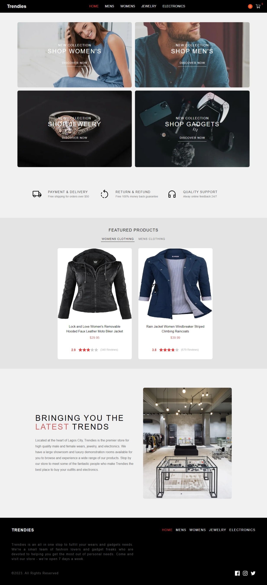

This is a [Next.js](https://nextjs.org/) project bootstrapped with [`create-next-app`](https://github.com/vercel/next.js/tree/canary/packages/create-next-app).

<!-- ## Getting Started

First, run the development server:

```bash
npm run dev
# or
yarn dev
# or
pnpm dev
```

Open [http://localhost:3000](http://localhost:3000) with your browser to see the result.

You can start editing the page by modifying `pages/index.tsx`. The page auto-updates as you edit the file.

[API routes](https://nextjs.org/docs/api-routes/introduction) can be accessed on [http://localhost:3000/api/hello](http://localhost:3000/api/hello). This endpoint can be edited in `pages/api/hello.ts`.

The `pages/api` directory is mapped to `/api/*`. Files in this directory are treated as [API routes](https://nextjs.org/docs/api-routes/introduction) instead of React pages.

This project uses [`next/font`](https://nextjs.org/docs/basic-features/font-optimization) to automatically optimize and load Inter, a custom Google Font. -->

## Table of contents

-   [Overview](#overview)
    -   [The app](#the-app)
    -   [Screenshot](#screenshot)
    -   [Links](#links)
-   [My process](#my-process)
    -   [Built with](#built-with)
    -   [Continued development](#continued-development)
-   [Author](#author)

## Overview

### The app

Users can:

-   View the optimal layout for the app depending on their device's screen size
-   Add/Remove products from the cart
-   Edit product quantities in the cart
-   Fill in all fields in the checkout
-   Receive form validations if fields are missed or incorrect during checkout
-   See correct checkout totals depending on the products in the cart
-   See an order and payment confirmation modal after checking out

### Screenshot



### Links

<!-- -   Live Site URL: [Netlify](https://samsegun-audiophile.netlify.app/) -->

### Built with

-   Flexbox
-   CSS Grid
-   Mobile-first workflow
-   [Next.js](https://nextjs.org/) - React framwork
-   [Tailwind Css](https://tailwindcss.com/) - For styles
-   [React Hook Form](https://react-hook-form.com/) - For forms
-   [Paystack](https://paystack.com/) - For payment integration
-   [Firebase](https://firebase.google.com/) - For authentication and database
-   [NProgress](https://www.npmjs.com/package/nprogress) - Progress bar
-   [Zustand](https://www.npmjs.com/package/zustand) - State management
-   [Axios](https://www.npmjs.com/package/axios) - Http client
-   [React-toastify](https://www.npmjs.com/package/react-toastify) - Notifications

### Continued development

I think the UI can be much better so if you're a UI/UX designer and feel you can develop a better UI for this project, i'm open to collaborations.

## Author

-   Github - [Samuel Oyebade](https://github.com/Samsegun/)
-   Twitter - [@samsegun10](https://www.twitter.com/samsegun10)
-   Mobile - +2348094942824
